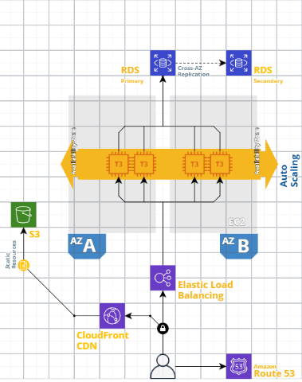
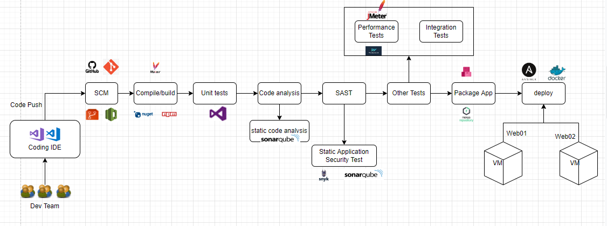

# nsearch-devops-challenge

#### Requirement

● A private isolated network which would best suit company’s 2 tier architecture needs. In order to meet their internal SLAs, they require a highly available solution as well.

● company being a B2C company, would typically like its web applications to be accessible over the internet and thus handle HTTP traffic.

● The database tier should have restricted access (not open to HTTP) and allow traffic only through the web tier.

● They would like to reduce the administrative burden of managing their SQL database and require a managed database for their SQL engine in the proposed solution. They need the database to be highly available.

● Currently they experience medium to high traffic on their network. How can they scale their application to meet demand?

● Effective distribution of load

● Recommend logging metrics collection and monitoring

● Recommend a DevOps pipeline

● Recommend types of testing methodology and tools(if applicable) Suggest software packaging, distribution and deployment mechanism

● What would you suggest for Infrastructure as code, testing and deploying changes

***AGENDA:***

As we are migrating from Onprem to AWS cloud, as a first step we can host our applications in Instances and using the aws PAAS services. Later once application is stable we can move to K8S(container level deployment).

In this implementations, I have added the other aws services to make architecutre work and application dependency level we may use in our two tier application.

AWS Services we are using in this architecture are:

    1. Amazon EC2 (Elastic Compute Cloud)
	
    2. Amazon RDS (Relational Database Service)

    3. Amazon Cloudfront (Content Delivery Network)

    4. Amazon S3 (For static content storage)

    5. Amazon ELB (Elastic Load Balancer)

    6. Amazon Route53 (Managed DNS Service)

    7. Auto Scaling Group at Web Tier

	
***ARCHITECTURE:***

As per the requirement I understood below points.

1. Out application is working in Tier 2 architecture model. These we are currently running in onprem servers/infrastructure.
2. Based on inputs, we are migrating our entire infra and application hosting to AWS Public Cloud. Lets start evaluating each step/phase in our requirement.

3. A private isolated network which would best suit company’s 2 tier architecture needs. In order to meet their internal SLAs, they require a highly available solution as well. 

      - Yes, as we hosted in our onprem here also we can create our private VPC(Virtual Private Cloud) network to host our application.
	  - Next step how we can make highly available and to serve the high traffic distribution, here we can use the EC2 instance to host application and add those instances to auto scaling group with ELB(Elastic Load Balancer). 
	  - Auto scaling group helps to scale the availability through Vertical autoscaling method or Horigental autoscaling.
	  - On High Availability, we will be hosting our web servers in two different availability zones so that if one availability zone goes down also still all requests take to other zone instance. This handeling will be taking care by Load Balancer.
	  
4. company being a B2C company, would typically like its web applications to be accessible over the internet and thus handle HTTP traffic.

      - Here, we will use the EC2 instances on back of ELB. ELB helps to take the request directly from internet with specific DNS zones and distribute the request to Webservers based on algoritham/methods in Load balancers like Round Robin, Least Conn...
	  - As we are keeping our ELB infront of Webservers, it will restrict the access to servers from internet on requests. One more benifit we can configure the domain in LB and restrict the public ip expose. It will reduce the risk to servers.

5. The database tier should have restricted access (not open to HTTP) and allow traffic only through the web tier.
 
      - As a security measurement, we should always restrict our Database to internet. All the data request and response can process through Web servers only.
	  - As it is in backend layer need to configure all the response or communication can go through TCP network layer level.
	  
6. They would like to reduce the administrative burden of managing their SQL database and require a managed database for their SQL engine in the proposed solution. They need the database to be highly available.

      - For this purpose, we have PAAS database service in AWS is RDS. This will reduce the much burdon to administrators to manage. Because AWS will take care of platform level maintanance we just need to use the platform and need to manage it on Database level.
	  - For Highly available of our data, we will be replicating all our data to other RDS. we can say Primary RDS database and Secondary RDS Database.
	     Can share clearly in our Architecutre Diagram below.
		 
7. Currently they experience medium to high traffic on their network. How can they scale their application to meet demand?

      - For this, usually we have two different types of autoscaling groups 1. Vertical Autoscaling Group and 2. Horigental Autoscaling group.
	  - We can select based on our traffic or usage , these ASG we will add to instances LB.
	  
8. Effective distribution of load

      - We can use Load Balancer for this to distribute the requests.
	  
9. Recommend logging metrics collection and monitoring

      - There are many metrics based on requirement, if need request logs, response logs we can use Cloud Watch. For log aggregation we can use EFK or ELK. And any application level transaction or request logs we can use Dynadrace for better understanding.
	  
10. Recommend a DevOps pipeline && Recommend types of testing methodology and tools(if applicable) Suggest software packaging, distribution and deployment mechanism
    
	  - In Any application we will be maintaining standard process to automate the build and deployment process. And will vary for container deployments(only difference on deployment)
	  
	  - Below is the different phases/stages we used to automate entire application Build and Deployment process.
	  
      
	  
	  
11. What would you suggest for Infrastructure as code, testing and deploying changes

      - I would suggest IAAC using Terraform, It has feasibility to do complex things in AWS. 
	  - We have flexibility to Configuration Management along with Terraform and it has many more extendable features for automating the Infra creation.